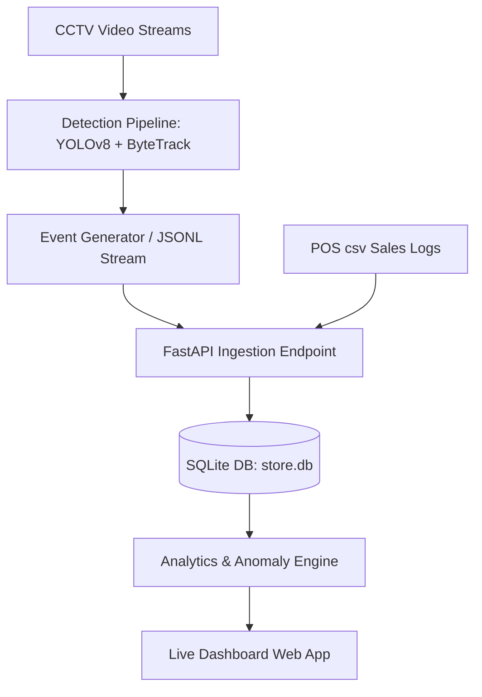

# System Architecture and Design

The Store Intelligence system translates raw camera feeds into actionable business analytics. 

## Component Diagram

## Camera Mapping & Layouts
- **CAM3**: Entry and Exit thresholds mapping (Entry gateway detection for Re-ID visitor token creation).
- **CAM1**: Skin Care product zone.
- **CAM2**: Makeup product zone.
- **CAM5**: Billing counter area.
- **CAM4**: Staff Room.

## AI-Assisted Decisions
- **Decision 1 (Model Selection)**: YOLOv8n was chosen over RT-DETR for lower memory footprint and latency constraint matching real-time 15fps edge environments.
- **Decision 2 (Staff Exclusion)**: Polygon zone filters (`COUNTER_STAFF` on CAM5) were used rather than color-based identification, which is susceptible to lighting variance.
- **Decision 3 (Re-ID Strategy)**: Implemented 5-minute spatial bounding-box window mapping to link returning visits to prevent vendor-related re-entry traffic inflation.
