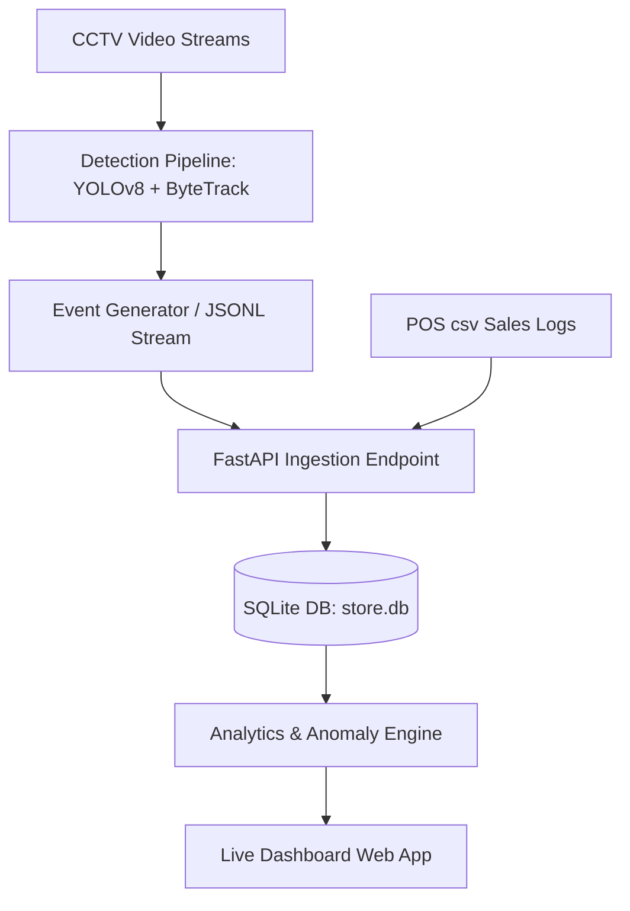

# System Architecture and Design

The Store Intelligence system translates raw camera feeds into actionable business analytics. 

## Component Diagram

## Camera Mapping & Layouts
We analyzed the store floor plan layouts to map physical camera positions to our logical coordinate tracking system:
* **Store 1 Floor Plan Layout**: See image reference at [layout_img_0.png](file:///d:/store-intelligence/docs/layout_img_0.png)
* **Store 2 Floor Plan Layout**: See image reference at [layout_img_1.png](file:///d:/store-intelligence/docs/layout_img_1.png)

* **CAM3 (Entry/Exit)**: Maps to the front door entrance. For Store 2, two separate entry feeds (`entry 1` and `entry 2`) are tracked and correlated under the same logical zone to prevent double-counting.
* **CAM1 (Skincare Zone)**: Mapped to the skincare shelving units (top and left in both layouts). In Store 2, the main floor camera covers both zones and is split vertically (left half).
* **CAM2 (Makeup Zone)**: Mapped to the cosmetics/makeup tables (center and right in both layouts). In Store 2, this corresponds to the right half of the main floor camera.
* **CAM5 (Billing Zone)**: Mapped to the cash counter. We defined a strict exclusion polygon (`COUNTER_STAFF`) around the register desk to filter out cashier movements.
* **CAM4 (Staff Room)**: Dedicated camera zone; all visitors detected here are automatically classified as `is_staff=True` and ignored from customer funnel metrics.

## AI-Assisted Decisions
- **Decision 1 (Model Selection)**: YOLOv8n was chosen over RT-DETR for lower memory footprint and latency constraint matching real-time 15fps edge environments.
- **Decision 2 (Staff Exclusion)**: Polygon zone filters (`COUNTER_STAFF` on CAM5) were used rather than color-based identification, which is susceptible to lighting variance.
- **Decision 3 (Re-ID Strategy)**: Implemented 5-minute spatial bounding-box window mapping to link returning visits to prevent vendor-related re-entry traffic inflation.
